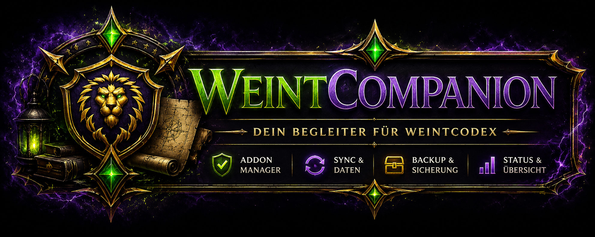

# WeintCompanion 5 — Forever Edition

<p align="center">
  
</p>

<p align="center">
  <strong>Die offizielle Desktop-Anwendung für WeintCodex.</strong><br>
  Für <em>World of Warcraft: Forever</em>.
</p>

---

# Übersicht

**WeintCompanion** ist die offizielle Desktop-Anwendung für das World of Warcraft Addon **WeintCodex**.

Die Anwendung übernimmt die Installation und Aktualisierung des Addons, erstellt automatisch Backups und verbindet Addon und Discord-Bot über eine Discord-Kontoverknüpfung.

## Was diese Fassung ist

Dies ist die Companion für **World of Warcraft: Forever** (erscheint am
4. November 2026). Sie ist aus der Fassung für *Mists of Pandaria
Classic* hervorgegangen — durch Wegnehmen, nicht durch Neubau:

* **Eine Spielversion.** Höchststufe 60, neun Klassen, siebenundzwanzig
  Talentbäume. MoP ist vollständig entfernt.
* **Ohne Simmen und WeakAuras.** Beides wird für Forever zunächst nicht
  unterstützt.
* **Neues Aussehen** („Graphit"): neutraler, kühler Grund, eine
  Serifenschrift für Überschriften, ein einziger Akzent, der
  ausschliesslich Bedeutung trägt.

**Die Spieldaten sind leer, und das mit Absicht.** Forever überarbeitet
jede Klasse, und die Bosslisten sind nicht veröffentlicht.
Bossmechaniken, Fähigkeiten je Spezialisierung und die
Klassenlektionen der Academy sind deshalb nicht aus MoP übernommen,
sondern leer — und die Oberfläche sagt „noch nicht bekannt" statt
etwas zu erfinden. Was fehlt, wann es kommt und in welcher Reihenfolge
es gefüllt wird, steht in
[`docs/systems/forever-data.md`](docs/systems/forever-data.md).

Die alte Companion (`daddler/WeintCompanion`) läuft für MoP Classic
weiter und behält ihren eigenen Update-Kanal.

Langfristig entsteht dadurch ein geschlossenes Ökosystem aus:

* 📦 **WeintCodex** – World of Warcraft Addon
* 🖥️ **WeintCompanion** – Desktop-Anwendung
* 🤖 **WeintCodex Bot** – Discord-Bot

Dadurch gehören manuelle Downloads, das Kopieren von Dateien und komplizierte Installationen der Vergangenheit an.

---

# Funktionen

## 🏠 Dashboard

* Übersicht über den aktuellen Status
* Automatische Erkennung der World of Warcraft Installation
* Anzeige der installierten Addon-Version
* Vergleich mit der neuesten GitHub-Version
* Installation oder Update mit nur einem Klick

---

## 📦 Addon-Verwaltung

* WeintCodex installieren
* Vorhandene Installation aktualisieren
* Installierte Version anzeigen
* Neueste GitHub-Version anzeigen
* Addon-Ordner direkt öffnen
* Automatische Backups vor jedem Update

---

## 🔄 Synchronisation

WeintCompanion verbindet sich per Discord-Login mit dem WeintCodex-Bot und tauscht darüber automatisch Daten mit dem Addon aus.

Bereits aktiv:

* Discord-Konto verknüpfen (Login über den Bot, in den Einstellungen)
* Bridge "Gilden-Kalender": Raid-Anmeldungen aus dem Addon werden in den Discord-Kalender übertragen
* Bridge "Charakter-Roster": die im Addon gewählten Twinks werden an den Bot gemeldet (Grundlage für den Klassen-Abgleich beim Gilden-Kalender-Invite)
* Bridge "Loot-Verteilung": erfasste Item-Zuteilungen werden an einen Discord-Kanal gemeldet (standardmäßig deaktiviert, umschaltbar über die Sync-Seite)

Geplant:

* Materialien
* Bossdaten

---

## ⚙️ Einstellungen

* World of Warcraft Pfad verwalten
* Download-Cache löschen
* Backups löschen
* Grundeinstellungen verwalten

---

## 📋 Logging

Alle Aktionen innerhalb der Anwendung werden automatisch protokolliert.

Dazu gehören unter anderem:

* Installationen
* Updates
* GitHub-Abfragen
* Statusmeldungen
* Fehler
* Synchronisationsvorgänge

Zusätzlich wird eine Logdatei erstellt, die bei der Fehlersuche unterstützt.

---

# Unterstützte Betriebssysteme

| Betriebssystem | Status        |
| -------------- | ------------- |
| Linux          | ✅ Unterstützt |
| Windows        | ✅ Unterstützt |
| macOS          | 📅 Geplant    |

---

# Roadmap

## Version 1.0

* Dashboard
* Addon-Installation
* Update-System (inkl. Prüfsummen-Verifikation)
* Backup-System
* Logging
* Discord-Verknüpfung, Gilden-Kalender-, Charakter-Roster- und Loot-Verteilung-Bridge

## Version 1.1

* Weitere Sync-Bridges (Materialien, Bossdaten)
* Verbesserter Installer

## Version 2.0

WeintCompanion entwickelt sich zur zentralen Verwaltungssoftware für das gesamte WeintCodex-Ökosystem.

---

# Projektstruktur

```text
WeintCompanion
│
├── addon/
├── assets/
├── cache/
├── core/
├── gui/
│
├── app.py
├── README.md
└── requirements.txt
```

---

# Entwicklung

WeintCompanion wird von **daddler2419** entwickelt und kontinuierlich erweitert.

Das Projekt entstand mit dem Ziel, die Verwaltung von **WeintCodex** zu vereinfachen und langfristig eine nahtlose Verbindung zwischen Addon, Desktop-Anwendung und Discord-Bot zu schaffen.

---

# Verwandte Projekte

* **WeintCodex** – World of Warcraft Addon
* **WeintCodex Bot** – Discord-Bot zur Verwaltung und Synchronisation
